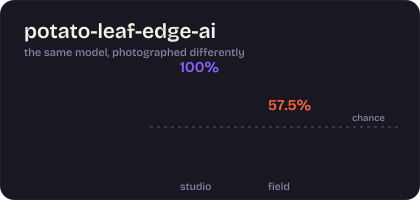
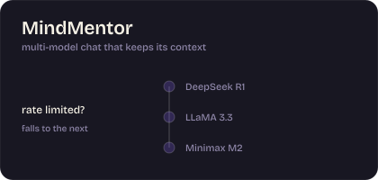
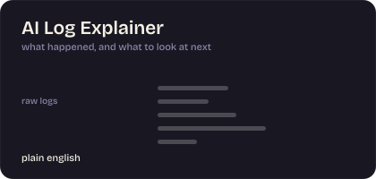
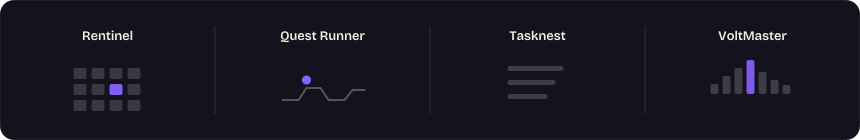

<picture>
  <source media="(prefers-color-scheme: dark)" srcset="assets/header-dark.svg">
  <source media="(prefers-color-scheme: light)" srcset="assets/header-light.svg">
  
</picture>

  <a href="https://hussainnawaz.vercel.app/"><b>Portfolio</b></a> ·
  <a href="https://linkedin.com/in/hussainawaz"><b>LinkedIn</b></a> ·
  <a href="mailto:husanawaz@gmail.com"><b>Email</b></a>

<table>
<tr>
<td width="50%"></td>
<td width="50%"></td>
</tr>
<tr>
<td width="50%"></td>
<td width="50%"></td>
</tr>
</table>

<a href="https://github.com/hussainwaz/Rentinel">Rentinel</a> ·
<a href="https://github.com/hussainwaz/Quest-Runner_2D-GAME">Quest Runner</a> ·
<a href="https://github.com/hussainwaz/Tasknest">Tasknest</a> ·
<a href="https://github.com/hussainwaz/VoltMaster">VoltMaster</a>

Every graphic here is a self-contained animated SVG: type outlined from Bricolage Grotesque, motion in CSS, still under reduced motion.
