🚀 &nbsp;Full-Stack Developer crafting web experiences, games, and interfaces

🎯 &nbsp;Currently building **the next big thing**

🌱 &nbsp;Mastering the art of clean, scalable code

⚡ &nbsp;Fun fact: I debug with coffee and deploy with prayers ☕🙏

**Frontend**

**Backend**

**Databases & Tools**

<picture>
  <source media="(prefers-color-scheme: dark)" srcset="https://raw.githubusercontent.com/hussainwaz/hussainwaz/output/github-snake-dark.svg" />
  <source media="(prefers-color-scheme: light)" srcset="https://raw.githubusercontent.com/hussainwaz/hussainwaz/output/github-snake.svg" />
  
</picture>

&nbsp;

&nbsp;

